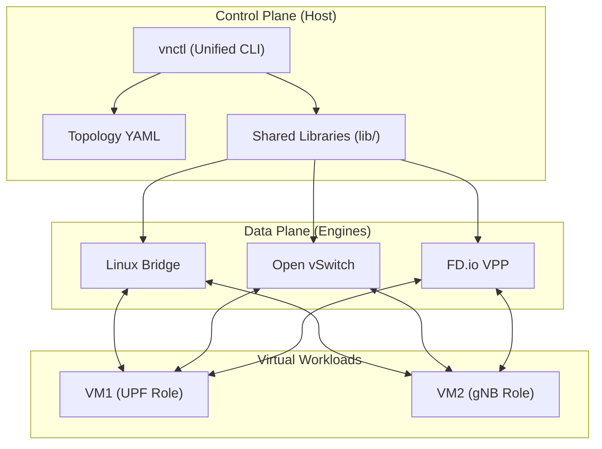

# 🌐 Virtual Networking Lab — OVS & VPP Integration


A modular, automated, and high-performance virtual networking environment designed for benchmarking and architectural analysis of **Linux Bridge**, **Open vSwitch (OVS)**, and **FD.io VPP** data plane technologies in a Network Functions Virtualization (NFV) context.

---

## 🏗️ Architecture

The project implements a strict separation between the **Control Plane** (orchestration logic) and the **Data Plane** (packet processing engines).



---

## 🚀 Quick Start

### 1. Installation
The lab is optimized for **openSUSE Tumbleweed** but compatible with most modern Linux distributions.

```bash
# Clone the repository
git clone <repo-url> virtual-networking && cd virtual-networking

# Install VPP (if needed)
sudo ./scripts/install-vpp.sh

# Configure HugePages (Required for VPP/DPDK performance)
sudo ./scripts/setup-hugepages.sh --persistent
```

### 2. System Readiness
Check if your environment supports KVM and required networking components:
```bash
./vnctl doctor
```

### 3. Deployment Flow
```bash
# Deploy a topology (e.g., OVS)
sudo ./vnctl deploy ovs

# Launch VMs (Background mode recommended for benchmarking)
sudo ./vnctl vm start vm1 --bg
sudo ./vnctl vm start vm2 --bg

# Check status
./vnctl status ovs
./vnctl vm list
```

---

## 📊 Performance Benchmarking

The lab includes a professional-grade benchmarking framework that captures throughput (TCP/UDP), latency, and engine-specific telemetry.

### Running Benchmarks
```bash
# Run full suite on OVS
sudo ./vnctl bench run ovs

# Benchmark ALL engines sequentially and generate a comparison
sudo ./vnctl bench run --all
```

### Generating Reports
View a color-coded comparison table in your terminal:
```bash
sudo ./vnctl bench compare
```

### Benchmark Methodology
- **Tooling**: `iperf3` for throughput, `ping` for latency, `TRex` for RFC 2544 testing.
- **Metrics**: 
    - **TCP Throughput**: Maximum achievable Gbps.
    - **UDP Packet Loss**: Loss % at a fixed target bitrate (e.g., 200 Mbps).
    - **Latency**: Average Round-Trip Time (RTT) in milliseconds.

---

## 🛠️ Advanced Features

### ⚡ DPDK Acceleration
Switch to userspace packet processing for maximum performance:
- **OVS-DPDK**: Uses `netdev` datapath (see `config/topology/ovs-dpdk.yaml`).
- **VPP-DPDK**: Bypasses the kernel entirely (see `config/vpp/startup-dpdk.conf`).

### 🤖 Cloud-Init Automation
Eliminate manual VM configuration. Automatically inject IPs, hostnames, and SSH keys:
```bash
# Generate seed ISOs for the OVS topology
./cloud-init/gen-cidata.sh ovs all
```

### 🦖 TRex Integration
For advanced RFC 2544 testing (throughput sweep across frame sizes):
```bash
# Run TRex profile (requires TRex installed)
python3 benchmark/trex-profile.py --engine vpp
```

---

## 📂 Project Structure

| Directory | Description |
|-----------|-------------|
| `vnctl` | **Main Entry Point**: Unified CLI for all operations. |
| `config/` | **Topology & Settings**: YAML definitions and VPP startup configs. |
| `lib/` | **Core Logic**: Shared libraries for Networking, VM lifecycle, and Parsing. |
| `engine/` | **Backends**: Implementation of LB, OVS, and VPP deployment logic. |
| `benchmark/` | **Performance**: Scripts for iperf3, TRex, and Report generation. |
| `scripts/` | **Automation**: Installation and environment setup scripts. |
| `docs/` | **Deep Dives**: Architecture, Tuning, and Benchmarking guides. |

---

## 📜 Commands Reference

| Command | Description |
|---------|-------------|
| `vnctl deploy <topo>` | Deploy network topology (lb, ovs, vpp, ovs-dpdk). |
| `vnctl teardown <topo>` | Remove all network interfaces and bridges. |
| `vnctl vm start <name>` | Launch a specific VM (use `--bg` for background). |
| `vnctl vm stop <name\|all>` | Gracefully terminate VM processes. |
| `vnctl bench run <topo\|--all>` | Execute performance tests. |
| `vnctl bench compare` | Generate a multi-engine comparison report. |
| `vnctl doctor` | Validate system prerequisites and dependencies. |
| `vnctl validate` | Check YAML topology files for syntax errors. |

---

## ❓ FAQ

**Q: Why is VPP throughput lower than OVS in the virtual lab?**  
A: In nested-KVM/WSL2, VPP often uses TAP interfaces which have context-switch overhead. To see VPP's true power, use DPDK on bare-metal.

**Q: How do I access a background VM's console?**  
A: Use `./vnctl vm console <vm_name>`. This connects via telnet to the VM's serial port.

**Q: Where are the test results saved?**  
A: Look in `results/<engine>/<timestamp>/`. Each run includes JSON data, human-readable text, and engine stats.

---

**Developed for the Telco NFV Research Lab.**  
*Maintained by the Network Software Engineering Team.*