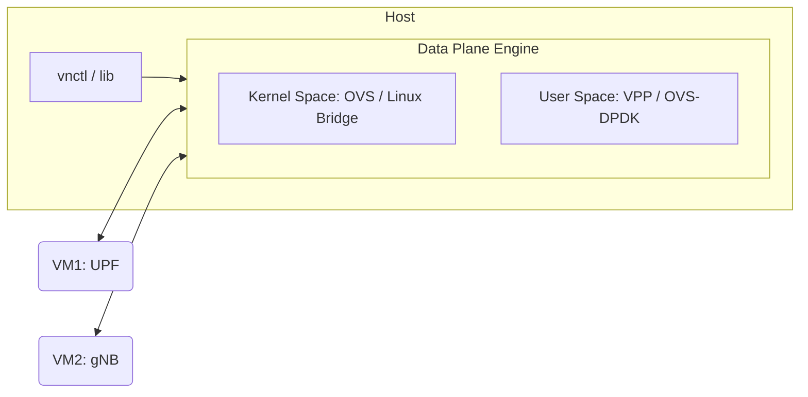

# Architecture — Virtual Networking Lab

## Overview

This project provides a unified environment for comparing three virtual networking technologies in an NFV (Network Functions Virtualization) context. It distinguishes between standard kernel-based bridging and high-performance userspace data planes.

| Engine | Technology | Data Path | Primary Use Case |
|--------|-----------|-----------|------------------|
| **Linux Bridge** | Kernel L2 bridge | Kernel | Baseline reference & standard Linux networking |
| **OVS** | Open vSwitch | Kernel (openvswitch.ko) | SDN, OpenFlow, and Cloud orchestration |
| **OVS-DPDK** | OVS + DPDK | Userspace (netdev) | High-performance SDN (DPDK-accelerated) |
| **VPP** | FD.io VPP | Userspace (TAP or DPDK) | High-throughput NFV & vector processing |

---

## Control Plane vs Data Plane Separation

The system follows a modular architecture where the **Control Plane** (orchestration) is strictly separated from the **Data Plane** (forwarding).

### Control Plane
- **`vnctl`**: The central dispatcher. It reads topology configurations and orchestrates the deployment of engines and VMs.
- **`lib/`**: Contains the "brain" of the project:
    - `config.sh`: YAML parser (with yq and awk backends).
    - `network.sh`: Primitive operations for TAPs, bridges, and IP assignment.
    - `vm.sh`: QEMU/KVM lifecycle management.
    - `benchmark.sh`: Standardized performance testing framework.

### Data Plane
Each engine implements a standard interface (`setup`, `teardown`, `status`) and manages the packet path between VMs.

---

## Packet Path Comparison

### 1. Linux Bridge (Baseline)
Packets move through the standard Linux kernel network stack.
- **Path**: `VM1 → Virtio → TAP0 → Linux Bridge (Kernel) → TAP1 → Virtio → VM2`
- **Pros**: Simple, built-in, highly stable.
- **Cons**: High overhead due to kernel context switching and interrupt processing.

### 2. OVS (Kernel Datapath)
Optimized for SDN and OpenFlow control.
- **Path**: `VM1 → Virtio → TAP0 → OVS Bridge (Kernel Datapath) → TAP1 → Virtio → VM2`
- **Pros**: Fast lookups via kernel flow cache (megaflows), programmable via OpenFlow.
- **Cons**: Initial packets incur a "miss" penalty (userspace upcall).

### 3. VPP (Userspace Vector Processing)
Optimized for high-throughput batch processing.
- **Path**: `VM1 → Virtio → TAP0 → VPP (Userspace) → TAP1 → Virtio → VM2`
- **Mechanism**: VPP processes a **vector** (batch) of packets through a directed graph of nodes. This maximizes instruction cache hits and minimizes CPU overhead per packet.

---

## Advanced Integrations

### DPDK (Data Plane Development Kit)
When running OVS or VPP in **DPDK mode**, the kernel is completely bypassed for packet I/O.
- **Requirement**: Physical NICs must be bound to `vfio-pci`.
- **WSL2 Note**: Since WSL2 uses a virtualized kernel, DPDK typically requires a physical NIC passed through via USBIP or running on bare-metal hardware.

### Cloud-Init Automation
The project supports zero-touch VM configuration using `NoCloud` cloud-init datasources.
1. `vnctl` identifies the VM's role and IP from the topology.
2. `gen-cidata.sh` creates a small ISO containing `user-data` and `meta-data`.
3. QEMU attaches the ISO as a readonly drive.
4. On boot, the VM's `cloud-init` service applies network settings, installs `iperf3`, and starts the benchmark server.

### TRex Traffic Generation
For industry-standard RFC 2544 testing:
- **TRex** acts as the traffic generator and receiver.
- It measures throughput vs. frame size (64B to 1518B).
- Integrates with the lab via `benchmark/trex-profile.py`.

---

## Directory Rationale

| Directory | Content | Rationale |
|-----------|---------|-----------|
| `config/topology/` | YAML Files | Defines the **Desired State** of the network. |
| `engine/` | Shell Scripts | Implements the **Provider Logic** for each technology. |
| `images/` | .qcow2 Files | Persistent disk storage (excluded from git). |
| `results/` | .json / .txt | Historical performance data for regression testing. |
| `lib/` | .sh | Reusable logic to avoid code duplication. |
